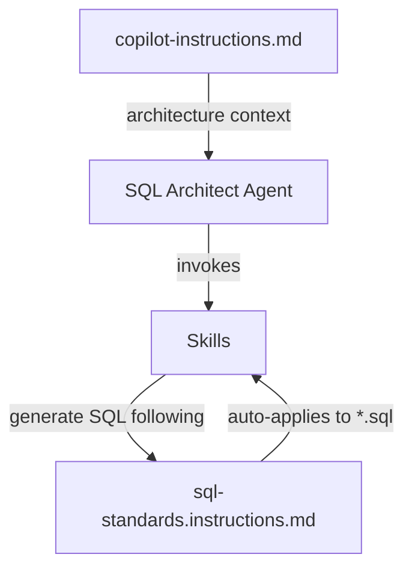

# VS Code Copilot Agents & Skills — Enterprise Data Platform

Custom **GitHub Copilot agents** and **skills** for VS Code that accelerate enterprise data engineering on Azure SQL Managed Instance using the **medallion architecture** pattern.

These agents automate T-SQL stored procedure generation, enforce safety guardrails, trace data lineage across architecture layers, and validate output against checklists — reducing manual effort and eliminating common errors in ETL development.

---

## Architecture Overview

| Layer | Purpose | Methodology | Database Pattern |
|-------|---------|-------------|------------------|
| **Bronze** | Source-aligned raw data | Exact replicas from APIs/source systems | `raw-[org]` |
| **Silver** | Conformed Enterprise Data Warehouse | Bill Inmon (3NF normalized) | `EDW` |
| **Gold** | Dimensional models for analytics | Ralph Kimball (star schema) | `reporting-[org]` |

---

## Agents

### Research Agent

> **Autonomous problem-solver** that handles complex, multi-step tasks end-to-end.

- Forces real-time internet research via web fetch (doesn't rely on stale training data)
- Resume/continue support — picks up exactly where it left off
- Rigorous testing and edge case validation before completion
- SQL safety rules: generates scripts only, never executes destructive operations
- Progress tracking with todo lists

### SQL Architect

> **Expert T-SQL code generator** with read-only database access and strict template enforcement.

- **Read-only enforcement** — physically cannot execute data-modifying statements
- **Template validation** — every procedure checked against a validation checklist
- **Mandatory workflow**: Load skill → Understand request → Generate → Validate
- Audit logging integration for all MERGE procedures
- 7 source system integrations across multi-subsidiary architecture

---

## Skills Catalog

| Skill | Purpose | Trigger Phrases |
|-------|---------|-----------------|
| **create-edw-procedures** | Generate [CREATE] procedures for initial EDW table loads | "Build a CREATE schema stored procedure" |
| **merge-edw-procedures** | Generate [MERGE] procedures for incremental EDW updates | "Build a MERGE schema stored procedure" |
| **create-reporting-procedures** | Generate [CREATE] procedures for Gold layer dimensional tables | "Build a CREATE reporting layer procedure" |
| **merge-reporting-procedures** | Generate [MERGE] procedures for Gold layer incremental updates | "Build a MERGE reporting procedure" |
| **find-edw-reporting-dependencies** | Trace downstream impact: EDW → Reporting | "Find reporting impact of EDW changes" |
| **find-raw-table-references** | Trace upstream lineage: Raw → EDW | "Find what references a raw table" |

---

## Design Decisions

### Why Hash-Based Change Detection (HASHBYTES)?

| Approach | Limitation |
|----------|-----------|
| Modified timestamp | Requires source to reliably track changes — many don't |
| Full table compare | O(n²) performance on large tables |
| **HASHBYTES (SHA2_256)** | ✅ Deterministic, source-agnostic, catches ALL column changes |

A single `VARBINARY(32)` column captures complete row state. Comparison is a simple inequality check — works regardless of whether source systems track modification dates.

### Why Fail-Safe Empty-Source Checks?

`WHEN NOT MATCHED BY SOURCE THEN DELETE` will **delete every row in the target** if the source returns zero rows (API failure, network timeout, empty extraction). The fail-safe:

```sql
IF EXISTS (SELECT 1 FROM [source_table])
BEGIN
    MERGE ...
END
ELSE
BEGIN
    -- Log as 'Skipped', do NOT delete anything
END
```

### Why Template Enforcement Via Validation Checklists?

With 50+ stored procedures following the same pattern, consistency is non-negotiable:
- Every procedure has identical error handling structure
- Audit logging is never accidentally omitted
- Hash calculations are always in the correct format
- New team members produce compliant code on day one

### Why Read-Only Guardrails on the SQL Architect Agent?

Defense-in-depth: an AI agent that generates SQL should never have the ability to execute destructive operations. The technical enforcement boundary means `INSERT`, `UPDATE`, `DELETE`, `DROP`, `ALTER`, `TRUNCATE` are all physically blocked.

### Why Audit Logging for MERGE but Not CREATE?

| Operation | Idempotent? | Needs Traceability? |
|-----------|-------------|---------------------|
| **CREATE** | ✅ Yes — DROP IF EXISTS + full reload | No |
| **MERGE** | ❌ No — incremental, stateful | **Yes** — need to know what changed and when |

---

## Project Structure

```
├── README.md
├── .github/
│   ├── copilot-instructions.md              # Project-level architecture context
│   └── instructions/
│       └── sql-standards.instructions.md    # SQL coding standards (auto-applied to *.sql)
├── agents/
│   ├── Research_Agent.md          # Autonomous research & implementation agent
│   └── SQL_Architect.agent.md     # Expert SQL code generation agent
└── skills/
    ├── create-edw-procedures/     # Initial load: Raw → EDW
    ├── merge-edw-procedures/      # Incremental update: Raw → EDW
    ├── create-reporting-procedures/  # Initial load: EDW → Reporting
    ├── merge-reporting-procedures/   # Incremental update: EDW → Reporting
    ├── find-edw-reporting-dependencies/  # Lineage: EDW → Reporting
    └── find-raw-table-references/        # Lineage: Raw → EDW
```

### How the Pieces Connect



---

## How to Use

### Prerequisites
- VS Code with [GitHub Copilot](https://github.com/features/copilot)
- [MSSQL extension](https://marketplace.visualstudio.com/items?itemName=ms-mssql.mssql) for database connectivity

### Installation
1. Copy `agents/` to your repo's `.github/agents/`
2. Copy `skills/` to your repo's `.github/skills/`
3. Copy `.github/copilot-instructions.md` and `.github/instructions/` to your repo

### Usage
- `@SQL Architect` — procedure generation, code reviews, schema design
- `@Research Agent` — complex multi-step tasks requiring internet research
- Natural language triggers: "Build a CREATE schema stored procedure for..."

---

## Technology Stack

- **Database**: Azure SQL Managed Instance
- **SQL Dialect**: T-SQL (Transact-SQL)
- **IDE**: VS Code with GitHub Copilot
- **Architecture**: Medallion (Bronze → Silver → Gold)
- **ETL Pattern**: MERGE with HASHBYTES + centralized audit logging
