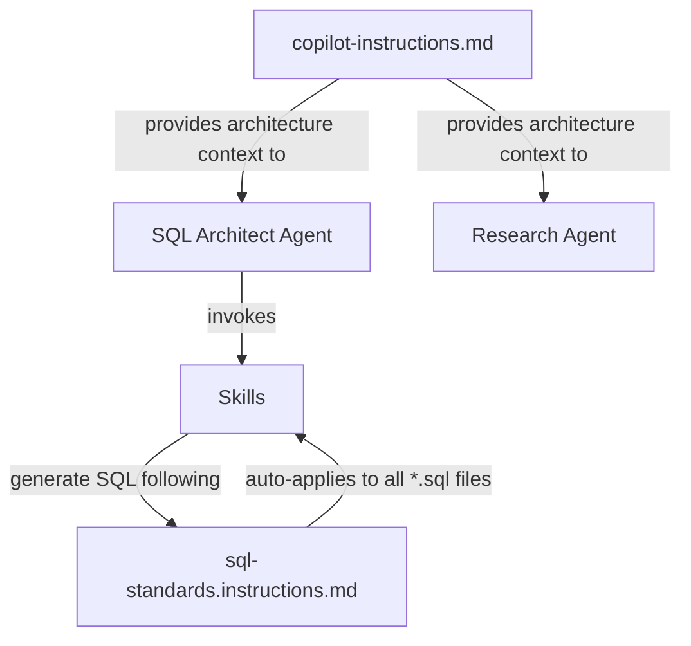

# VS Code Copilot Agents & Skills — Enterprise Data Platform

A collection of custom **GitHub Copilot agents** and **skills** built for VS Code, designed to accelerate enterprise data engineering on Azure SQL Managed Instance using the **medallion architecture** pattern.

These agents automate the generation, review, and validation of T-SQL stored procedures, trace data lineage across architecture layers, and enforce safety guardrails — reducing manual effort and eliminating common errors in ETL development.

---

### Medallion Architecture Layers

| Layer | Purpose | Methodology |
|-------|---------|-------------|
| **Bronze** | Source-aligned raw data | Exact replicas from APIs/source systems |
| **Silver** | Conformed Enterprise Data Warehouse | Bill Inmon (3NF normalized) |
| **Gold** | Dimensional models for analytics | Ralph Kimball (star schema) |

---

## Agents

### Research Agent

> **Autonomous problem-solver** that handles complex, multi-step tasks end-to-end without yielding control.

| Capability | Description |
|------------|-------------|
| Internet Research | Recursively fetches URLs, documentation, and forums to stay current |
| Codebase Investigation | Deep exploration of files, functions, and dependencies |
| Iterative Implementation | Plans → implements → tests → iterates until solved |
| Database Safety | Built-in guardrails prevent accidental data modification |
| Progress Tracking | Maintains todo lists, checks items off, never stops early |

**Key features:**
- Forces real-time research via web fetch (doesn't rely on potentially stale training data)
- Resume/continue support — picks up exactly where it left off
- Rigorous testing and edge case validation before completion
- SQL safety rules: generates scripts only, never executes destructive operations

### SQL Architect

> **Expert T-SQL code generator** with read-only database access and strict template enforcement.

| Capability | Description |
|------------|-------------|
| Procedure Generation | CREATE and MERGE stored procedures from templates |
| Schema Design | Table structures aligned with medallion architecture |
| Code Review | Security, performance, and standards compliance checks |
| Data Transformation | ETL logic with hash-based change detection |
| Dependency Tracing | Finds upstream/downstream impacts of schema changes |

**Key features:**
- **Read-only enforcement** — physically cannot execute data-modifying statements
- **Template validation** — every generated procedure is checked against a validation checklist
- **Mandatory workflow**: Load skill → Understand request → Generate → Validate
- Audit logging integration for all MERGE procedures
- Construction industry domain knowledge (Procore, CMiC, Dynamics CRM, etc.)

---

## Skills Catalog

| Skill | Purpose | Trigger Phrases |
|-------|---------|-----------------|
| **create-edw-procedures** | Generate [CREATE] schema procedures for initial EDW table loads from Bronze | "Build a CREATE schema stored procedure" |
| **merge-edw-procedures** | Generate [MERGE] schema procedures for incremental EDW updates with audit logging | "Build a MERGE schema stored procedure" |
| **create-reporting-procedures** | Generate [CREATE] schema procedures for Gold layer dimensional tables | "Build a CREATE reporting layer procedure" |
| **merge-reporting-procedures** | Generate [MERGE] schema procedures for Gold layer incremental updates | "Build a MERGE reporting procedure" |
| **find-edw-reporting-dependencies** | Trace downstream impact: EDW → Reporting layer | "Find reporting impact of EDW changes" |
| **find-raw-table-references** | Trace upstream lineage: Raw → EDW layer | "Find what references a raw table" |

### Skill Structure

Each skill follows a consistent pattern:

```
skills/
└── skill-name/
    ├── SKILL.md              # Full instructions, naming conventions, validation checklist
    ├── template.sql          # Parameterized SQL template
    └── examples/
        └── example.sql       # Working implementation with real-world columns
```

---

## Design Decisions

### Why Hash-Based Change Detection (HASHBYTES) Over Timestamps?

| Approach | Limitation |
|----------|-----------|
| **Modified timestamp** | Requires source system to reliably track changes — many don't |
| **Full table compare** | O(n²) performance on large tables |
| **HASHBYTES (SHA2_256)** | ✅ Deterministic, source-agnostic, catches ALL column changes |

Hash-based detection works regardless of whether the source system tracks modification dates. A single `VARBINARY(32)` column captures the complete row state, and comparison is a simple inequality check. This is critical when integrating 7+ source systems (Procore, CMiC, Dynamics, Deltek, etc.) with varying change-tracking capabilities.

### Why Fail-Safe Empty-Source Checks Before MERGE?

The `WHEN NOT MATCHED BY SOURCE THEN DELETE` clause in a MERGE statement will **delete every row in the target** if the source query returns zero rows (e.g., API failure, network timeout, empty extraction). 

Our fail-safe pattern:
```sql
IF EXISTS (SELECT 1 FROM [source_table])
BEGIN
    MERGE ...
END
ELSE
BEGIN
    -- Log as 'Skipped', do NOT delete anything
END
```

This single check has prevented multiple production incidents where upstream API failures would have cascaded into complete table wipes.

### Why Template Enforcement Via Validation Checklists?

With 50+ stored procedures following the same pattern across an enterprise, **consistency is non-negotiable**. Template enforcement ensures:
- Every procedure has the same error handling structure
- Audit logging is never accidentally omitted
- Hash calculations are always in the correct format
- New team members produce compliant code on day one

The validation checklist (15-22 items per procedure type) catches deviations before they reach code review.

### Why Read-Only Guardrails on the SQL Architect Agent?

Defense-in-depth: An AI agent that generates SQL should never have the ability to execute destructive operations. Even with safety prompts, the technical enforcement boundary means:
- `INSERT`, `UPDATE`, `DELETE`, `DROP`, `ALTER`, `TRUNCATE` — all physically blocked
- The agent generates scripts that humans review and execute manually
- Eliminates an entire class of potential accidents

### Why Audit Logging for MERGE but Not CREATE?

| Operation | Idempotent? | Needs Traceability? |
|-----------|-------------|---------------------|
| **CREATE** | ✅ Yes — `DROP IF EXISTS` + full reload | No — it rebuilds from scratch every time |
| **MERGE** | ❌ No — incremental, stateful | **Yes** — need to know what changed, when, and how many rows |

CREATE procedures are inherently safe to re-run (they drop and rebuild). MERGE procedures modify existing data incrementally — audit logging captures insert/update/delete counts, execution timing, and error details for data governance and troubleshooting.

---

## How to Use

### Prerequisites
- VS Code with [GitHub Copilot](https://github.com/features/copilot) extension
- [MSSQL extension](https://marketplace.visualstudio.com/items?itemName=ms-mssql.mssql) for database connectivity

### Installation

1. Copy the `agents/` folder to your repository's `.github/agents/` directory
2. Copy the `skills/` folder to your repository's `.github/skills/` directory
3. The agents and skills will be automatically detected by VS Code Copilot

### Usage

Invoke agents in VS Code Copilot Chat:
- `@SQL Architect` — for procedure generation, code reviews, and schema design
- `@Research Agent` — for complex multi-step tasks requiring internet research

Trigger skills with natural language:
- "Build a CREATE schema stored procedure for the daily log completion entity"
- "Build a MERGE reporting procedure for the Inspections fact table"
- "Find what reporting procedures reference the EDW daily log table"
- "Trace what EDW procedures use the raw opportunities table"

---

## Technology Stack

- **Database**: Azure SQL Managed Instance
- **SQL Dialect**: T-SQL (Transact-SQL)
- **IDE**: VS Code with GitHub Copilot
- **Architecture**: Medallion (Bronze → Silver → Gold)
- **ETL Pattern**: MERGE with HASHBYTES change detection + centralized audit logging

---

## Project Structure

```
├── README.md
├── .github/
│   ├── copilot-instructions.md              # Project-level architecture context
│   └── instructions/
│       └── sql-standards.instructions.md    # SQL coding standards (auto-applied to *.sql)
├── agents/
│   ├── Research_Agent.md          # Autonomous research & implementation agent
│   └── SQL_Architect.agent.md     # Expert SQL code generation agent
└── skills/
    ├── create-edw-procedures/     # Initial load: Raw → EDW
    ├── merge-edw-procedures/      # Incremental update: Raw → EDW
    ├── create-reporting-procedures/  # Initial load: EDW → Reporting
    ├── merge-reporting-procedures/   # Incremental update: EDW → Reporting
    ├── find-edw-reporting-dependencies/  # Lineage: EDW → Reporting
    └── find-raw-table-references/        # Lineage: Raw → EDW
```

### How the Pieces Connect



- **`copilot-instructions.md`** — Loaded automatically by VS Code Copilot for every conversation. Defines the medallion architecture, naming conventions, database catalog, data domains, and safety rules.
- **`sql-standards.instructions.md`** — Auto-applied via `applyTo: "**/*.sql"` whenever Copilot generates or reviews SQL files. Enforces formatting, parameterization, transaction patterns, and performance practices.
- **Agents** — Reference the architecture context and invoke skills for specific procedure types.
- **Skills** — Contain templates, examples, and validation checklists that produce standards-compliant SQL.

---

## License

MIT License — see [LICENSE](LICENSE) for details.
